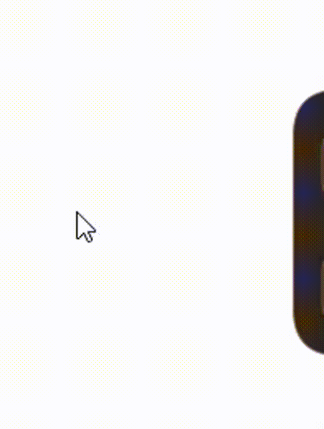

<p align="center">
  
  
</p>

# eDock

eDock is a Python desktop dock that sits on the edge of your screen and gives you quick access to small apps and tools.

Each icon in the dock is a real Python app.

eDock is designed for an open app ecosystem where every app stays accessible, readable, and extensible.

---
# Usage

Install Python:
```text
https://www.python.org/downloads/
```

Install Git:
```text
https://github.com/git-guides/install-git
```

Clone the repository:
```bash
git clone https://github.com/emanf/edock.git
```
```bash
cd edock
```

Install pip:
```bash
python -m ensurepip --upgrade
```

Install dependencies:
```bash
pip install -r requirements.txt
```

Run eDock:
```bash
python main.py
```

---

- Python
- PySide6 / Qt for Python

---

Contributions are welcome.

You can help by:

- Reporting bugs
- Suggesting ideas
- Improving the code
- Improving the UI
- Creating eDock apps
- Improving documentation

# App Registry

eDock includes a public app registry where developers can publish and distribute their apps.
The registry repository contains the app indexes and packages used by eDock to discover and install apps.
Developers can submit their apps to the registry so they become available for all eDock users.
App submissions are automated and reviewed through the registry workflow.
For details on how the registry works and how to submit an app, see:
```text
https://github.com/emanf/eDock-Apps
```
