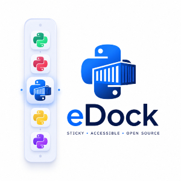

<p align="center"></p>

**Build, discover, install, and run Python apps from source code.**

eDock is a free, source-available Python project that gives developers a simple workflow for creating automation apps, bots, tools, and utilities.

Users can search for apps, install them, edit their source code, and run them directly from source.

Every eDock app is open, editable, and easy to improve.

---

eDock is a simple app platform for Python automation tools.

With eDock, developers can create:

- Simple task apps
- Bots
- Automation scripts
- Developer tools
- Desktop utilities
- Bigger Python apps

Users can:

- Search for apps using Spotlight-style search
- Install apps easily
- Run apps from source code
- View and edit app code
- Improve and customize apps

---

Most apps hide their code.

eDock is different.

Every app comes with source code and only runs from source code. This makes apps transparent, customizable, and useful for developers and users.

---

- Free and source-available
- Simple workflow for developers
- Search and discover apps
- Install apps easily
- Run apps directly from source
- Edit and improve any app
- Great for automation, bots, and tools
- Built with Python and PySide6

---

Download Python:
```bash
https://www.python.org/downloads/
```
Clone the repository:
```bash
git clone https://github.com/emanf/edock.git
cd edock
```
Install dependencies:

```bash
pip install -r requirements.txt
```

Run eDock:

```bash
python main.py
```

---

- Python
- PySide6 / Qt for Python

---

Contributions are welcome.

You can help by:

- Reporting bugs
- Suggesting ideas
- Improving the code
- Improving the UI
- Creating eDock apps
- Improving documentation

Fork the repository, make your changes, and open a pull request.

---

eDock is a source-code-first platform for Python apps.

It gives developers a clean way to build and share apps, and gives users the freedom to inspect, edit, improve, and run them.
